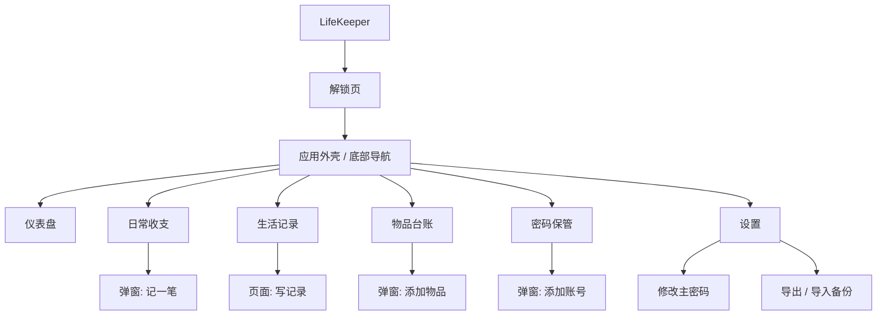
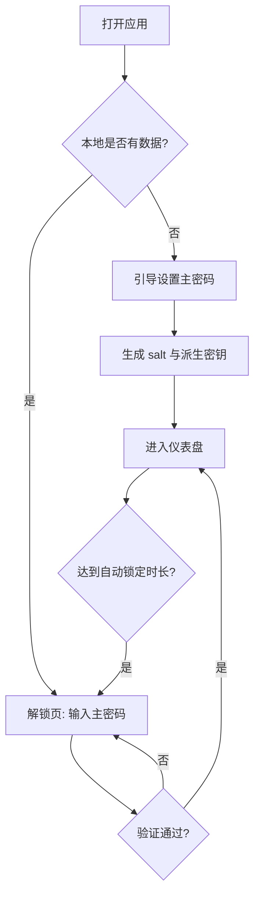
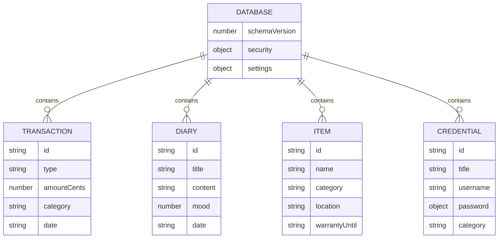

# LifeKeeper 需求文档（PRD）

## 文档信息

| 项目 | 内容 |
|---|---|
| 产品名称 | LifeKeeper（中文：生活管家） |
| 文档版本 | v0.1（草稿，待评审） |
| 创建日期 | 2026-10-06 |
| 开发方式 | DeepSeek Harness 桌面版，由 AGENTS.md 驱动编码 Agent |
| 关联文档 | `AGENTS.md`（工程规范）、`DESIGN.md`（视觉规范，**待创建**） |
| 参考资料库 | `awesome-design-md/`（只读，内含 70+ 品牌 DESIGN.md） |

---

## 1. 项目概述

### 1.1 产品定位
LifeKeeper 是一款**纯前端、本地优先（local-first）、隐私优先（privacy-first）**的个人生活管理网页应用，把四件高频琐事集中到一个页面：

1. 日常收支（记账）
2. 生活记录（日记 / 随笔）
3. 重要物品存放（物品台账，回答"东西放哪了"）
4. 账号密码保管（本地加密的密码库）

数据**只保存在用户本机浏览器**，不依赖服务器、不需要注册账号、不主动上传任何数据。

### 1.2 一句话介绍
> 一个装在浏览器里的私人生活保险箱：钱花在哪、日子怎么过、东西放哪、密码是什么，LifeKeeper 帮你记着。

### 1.3 目标用户
20 岁以上、有自我管理需求的人群，重点覆盖：

| 用户群 | 核心痛点 |
|---|---|
| 大学生（20-22 岁） | 生活费有限、账目琐碎；宿舍/搬迁导致物品流动；校园系统账号多、密码易忘 |
| 研究生（22-28 岁） | 补助+兼职多笔收入；设备多、保修信息分散；科研生活需要随手记录 |
| 职场新人（22-30 岁） | 工资/房租/社保等固定收支；证件合同重要；工作账号密码复杂度要求高、更换设备需迁移数据 |

### 1.4 使用环境
- **高频记录场景：手机浏览器**；**整理与统计场景：电脑浏览器**
- 开发期通过 VSCode Live Server 打开；成品可直接本地使用或部署到任意静态托管
- 核心功能**离线可用**

---

## 2. 产品目标与设计原则

| # | 原则 | 含义 |
|---|---|---|
| P1 | 隐私优先 | 密码等敏感数据必须加密存储；应用不包含追踪/统计脚本，业务数据不发起网络请求 |
| P2 | 本地优先 | 所有数据保存在本机；用户通过加密备份文件自行迁移，无需账号体系 |
| P3 | 开箱即用 | 首次打开设置主密码即可使用，无需注册、无需配置 |
| P4 | 3 秒记录 | 记一笔账、写一条记录的操作路径不超过 3 次点击 |
| P5 | 移动优先 | 先保证手机端好用，桌面端做布局增强 |
| P6 | 可维护 | 数据访问、加密、业务模块分层解耦，便于迭代 |

### 本期"不做什么"（范围边界）
- 不做多人协作、用户账号体系、服务端云同步
- 不做银行 / 支付平台账单自动导入
- 不做理财推荐、投资分析
- 不做原生移动 App

---

## 3. 用户画像与典型场景

### P1 本科生·小唐（21 岁）
- 每月固定生活费，想知道钱花在哪；换季时总找不到证件；各类校园 App 密码混乱
- 场景：食堂吃完午饭，手机记一笔 12.5 元餐饮支出；办银行卡前搜"身份证"，立刻看到存放位置

### P2 研究生·小周（24 岁）
- 有国家补助+横向兼职收入；相机、平板等设备保修单分散；想用日记记录科研进展
- 场景：月底查看本月收支与分类占比；录入相机保修截止日，到期前在仪表盘收到提醒

### P3 职场新人·小李（25 岁）
- 工资、房租、社保等账目固定；合同、毕业证等重要文件集中保管；公司 VPN/系统密码复杂
- 场景：换新电脑后，用加密备份文件一键恢复全部数据；在密码库查找 VPN 账号并一键复制

---

## 4. 功能范围（MoSCoW 优先级）

### Must have —— MVP v1.0 必须交付
| 编号 | 模块 |
|---|---|
| M0 | 应用初始化 / 主密码锁定与解锁 |
| M1 | 仪表盘（首页概览） |
| M2 | 日常收支：增删改查、分类、月度统计 |
| M3 | 生活记录：增删改查、标签、搜索 |
| M4 | 物品台账：增删改查、存放位置、保修提醒 |
| M5 | 密码保管：加密存储、查看/复制、密码生成器 |
| M6 | 设置：修改主密码、数据导出/导入、清空数据 |

### Should have —— 尽量交付
- 深色模式、自动锁定计时、记账图表（趋势/占比）、保修临期提醒、常用位置快捷选择

### Could have —— 后续版本
- 心情/天气、图片附件、草稿自动保存、预算与超支提醒、周期账单、纪念日/待办/习惯打卡

### Won't have —— 本期明确不做
- 云同步、多人协作、自动账单导入、原生 App、理财推荐

---

## 5. 功能需求详述

### M0 应用初始化与锁定
| 编号 | 需求 |
|---|---|
| F0-1 | 首次打开（本地无数据）：引导设置主密码，**不少于 8 位**，需二次确认；同时生成随机 salt 与密码校验值 |
| F0-2 | 非首次打开：进入解锁页，输入主密码验证；连续 5 次错误给出提示并前端冷却 30 秒 |
| F0-3 | 解锁成功后由主密码派生加密密钥，仅驻留内存；锁定或关闭页面时立即清除 |
| F0-4 | **不提供"找回密码"**：忘记主密码即数据不可恢复，初始化页与解锁页必须明确提示；提供"清空数据重新开始"入口 |
| F0-5 | 自动锁定：默认 5 分钟无操作回到解锁页（时长可在设置中调整） |

**验收标准**：刷新页面、未解锁状态下看不到任何业务数据；错误密码无法解锁；锁定后内存中无密钥与明文。

### M1 仪表盘
- 概览卡片：本月收入 / 本月支出 / 本月结余；物品总数与临期保修数；密码库条目数
- 最近动态：最近 3 笔收支、最近 2 条生活记录
- 四个快捷入口：记一笔、写记录、存物品、加账号
- **验收**：所有数字与各模块实时一致；空数据时展示空状态与引导。

### M2 日常收支
**字段**：类型（收入/支出）、金额、分类、日期时间（默认当前）、账户（可选）、备注、标签

- 支出分类（默认）：餐饮、交通、购物、学习、娱乐、医疗、居家、人情、其他
- 收入分类（默认）：工资/补助、兼职、奖学金、红包、投资、其他
- 账户（默认）：现金、储蓄卡、支付宝、微信（允许自定义）

| 编号 | 需求 |
|---|---|
| F2-1 | 快速记账：页面常驻"记一笔"悬浮按钮，弹窗填写 |
| F2-2 | 流水按日分组、倒序展示；支持按月切换，按类型/分类/关键词筛选 |
| F2-3 | 编辑、删除流水（删除需二次确认） |
| F2-4 | 统计：月度收入/支出/结余；分类支出占比；近 6 个月收支趋势（Should） |
| F2-5 | 金额规则：必须为正数、最多两位小数；**金额以"分"的整数存储**，避免浮点误差 |

**验收**：月度汇总恒等于当月明细之和；跨月切换数据正确；1000 条流水内列表操作无明显卡顿。

### M3 生活记录
**字段**：标题（可空，默认用日期代替）、正文、日期、心情（可选，5 档）、标签、创建/更新时间

| 编号 | 需求 |
|---|---|
| F3-1 | MVP 仅支持纯文本+换行，不做复杂富文本 |
| F3-2 | 时间线视图按日期倒序；支持按标签筛选 |
| F3-3 | 搜索覆盖标题、正文、标签 |
| F3-4 | 编辑、删除记录（删除需二次确认） |
| F3-5 | 草稿自动保存（Should） |

**验收**：断网状态可正常写入；已保存内容刷新不丢失。

### M4 重要物品台账
**字段**：名称、分类、存放位置、数量、购买日期（可选）、保修截止（可选）、备注、标签、图片（可选，后续）

- 分类（默认）：证件、电子设备、钥匙箱包、文件资料、首饰贵重、其他

| 编号 | 需求 |
|---|---|
| F4-1 | 核心动作：搜索名称/位置/备注，快速回答"东西在哪" |
| F4-2 | 存放位置提供常用位置快捷选择（如：书桌左抽屉、卧室衣柜、老家），选中后可补充细节 |
| F4-3 | 保修提醒：截止前 30 天内标"临期"（黄），已过截止标"已过期"（红），并汇总到仪表盘 |
| F4-4 | 编辑、删除物品 |

**验收**：搜索"身份证"能立即看到存放位置；临期/过期状态按当天日期计算正确。

### M5 密码保管
**字段**：名称、网站/应用名、网址（可选）、账号用户名、密码（**密文**）、备注（可选加密）、分类、更新时间

| 编号 | 需求 |
|---|---|
| F5-1 | 密码字段使用 AES-GCM 加密后存储；列表中密码始终以掩码显示 |
| F5-2 | 点击"眼睛"图标临时显示明文；账号、密码分别提供复制按钮 |
| F5-3 | 新增/编辑时内置密码生成器：长度 12-24 可选，大小写字母/数字/符号可勾选，展示强度 |
| F5-4 | 搜索、分类筛选、编辑、删除（删除需二次确认） |
| F5-5 | 安全红线：① 严禁明文持久化密码与主密码；② 严禁 console 打印明文；③ 明文只存在于内存与用户主动操作瞬间 |

**验收**：直接查看浏览器存储只能看到密文；错误主密码下无法解密；锁定后密文不可读。

### M6 设置
| 编号 | 需求 |
|---|---|
| F6-1 | 修改主密码：先验证旧密码，更换后用新密钥重新加密全部密文 |
| F6-2 | 偏好设置：自动锁定时长、主题（浅色/深色/跟随系统）、货币符号 |
| F6-3 | 导出备份：**加密备份（推荐）** 为 JSON 文件，整体受主密码保护；明文导出需强风险提示，密码字段留空或仅导出掩码 |
| F6-4 | 导入备份：选择文件 → 校验格式与主密码 → 预览内容 → 选择"合并"或"覆盖" |
| F6-5 | 清空所有数据：高危操作，需输入主密码并二次确认 |
| F6-6 | 关于页：版本号、离线说明、隐私声明 |

**验收**：导出 → 清空 → 导入后数据完整可用；损坏文件/错误密码有明确报错，不污染现有数据。

---

## 6. 信息架构与页面流程

### 6.1 模块导航结构



### 6.2 启动与解锁流程



---

## 7. 数据结构设计

### 7.1 存储根结构（单一数据源）

```json
{
  "app": "life-keeper",
  "schemaVersion": 1,
  "meta": { "createdAt": "2026-10-06T10:00:00+08:00", "updatedAt": "2026-10-06T10:00:00+08:00" },
  "security": {
    "kdf": "PBKDF2",
    "iterations": 210000,
    "salt": "<base64 随机盐>",
    "verifier": "<主密码校验密文>",
    "autoLockMinutes": 5
  },
  "settings": { "theme": "system", "currency": "CNY" },
  "transactions": [],
  "diaries": [],
  "items": [],
  "credentials": []
}
```

### 7.2 通用约定
- **公共字段**（所有条目都包含）：`id`（`crypto.randomUUID()` 生成）、`createdAt`、`updatedAt`、`tags`（字符串数组）
- **时间**：统一 ISO 8601 字符串（带时区）
- **金额**：以"分"为单位的整数（如 12.5 元存为 `1250`），展示时除以 100
- **密文结构**：统一为 `{ "iv": "<base64>", "ct": "<base64>" }`，算法 AES-GCM-256

### 7.3 各模块条目示例

**收支 Transaction**
```json
{
  "id": "t_550e8400-e29b-41d4-a716-446655440000",
  "type": "expense",
  "amountCents": 1250,
  "category": "餐饮",
  "account": "微信",
  "date": "2026-10-06T12:20:00+08:00",
  "note": "食堂午餐",
  "tags": ["校园"],
  "createdAt": "2026-10-06T12:21:00+08:00",
  "updatedAt": "2026-10-06T12:21:00+08:00"
}
```

**生活记录 Diary**
```json
{
  "id": "d_...",
  "title": "",
  "content": "今天完成了开题报告初稿，和导师约了周五讨论。",
  "mood": 4,
  "date": "2026-10-06T22:00:00+08:00",
  "tags": ["科研"],
  "createdAt": "2026-10-06T22:05:00+08:00",
  "updatedAt": "2026-10-06T22:05:00+08:00"
}
```

**物品 Item**
```json
{
  "id": "i_...",
  "name": "身份证",
  "category": "证件",
  "location": "书桌左抽屉·蓝色文件袋",
  "quantity": 1,
  "purchaseDate": null,
  "warrantyUntil": null,
  "note": "",
  "tags": ["重要"],
  "createdAt": "2026-10-06T10:00:00+08:00",
  "updatedAt": "2026-10-06T10:00:00+08:00"
}
```

**账号密码 Credential**
```json
{
  "id": "c_...",
  "title": "校园 VPN",
  "site": "VPN 系统",
  "url": "https://vpn.school.edu.cn",
  "username": "24215410143",
  "password": { "iv": "<base64>", "ct": "<base64>" },
  "note": "",
  "category": "学习",
  "createdAt": "2026-10-06T10:00:00+08:00",
  "updatedAt": "2026-10-06T10:00:00+08:00"
}
```

### 7.4 实体关系



---

## 8. 非功能需求

| 类别 | 要求 |
|---|---|
| **安全** | 仅使用浏览器原生 Web Crypto API（SubtleCrypto）；无第三方统计/追踪脚本；建议配置 CSP；用户内容一律 `textContent` 渲染，防 XSS |
| **性能** | 1000 条数据内常规操作响应 < 100ms；本地首屏加载 < 2 秒 |
| **容量** | MVP 使用 localStorage（约 5MB）；数据超 2000 条或需要图片附件时切换 IndexedDB（通过存储适配层无感切换） |
| **兼容性** | Chrome/Edge 100+、Safari 15+、移动端 iOS Safari / 安卓 Chrome |
| **响应式** | 断点：<640px 手机 / 640-1024px 平板 / >1024px 桌面；触控目标 ≥ 44px |
| **可访问性** | 语义化标签、表单关联 label、键盘可操作、正文对比度 ≥ 4.5:1 |
| **安全上下文** | Web Crypto 仅在安全上下文可用：**必须通过 Live Server（http://127.0.0.1）访问，禁止直接双击 index.html（file://）** |
| **文案** | 简体中文优先，文案集中管理，预留多语言能力 |

---

## 9. 技术栈与目录结构

### 9.1 技术选型
- **结构/样式/逻辑**：HTML5 + Tailwind CSS + 原生 JavaScript（ES Modules）
- **存储**：自研存储适配层（MVP 落 localStorage，接口按 IndexedDB 设计）
- **加密**：浏览器原生 Web Crypto API（PBKDF2 + AES-GCM）
- **图表**（Should）：本地引入 ECharts；MVP 可用纯 CSS 图表替代
- **Tailwind 引入方式**：原型阶段可用 Play CDN；正式交付前改为 Tailwind CLI 本地构建，保证离线与 CSP 友好

### 9.2 规划目录结构

```text
life-keeper/
├── AGENTS.md              # 工程全局指令（编码 Agent 遵循）
├── DESIGN.md              # 视觉唯一标准（待创建）
├── 需求文档.md            # 本文档
├── README.md              # 运行说明（待创建）
├── index.html             # 单页应用入口
├── assets/
│   ├── icons/             # 本地图标
│   └── fonts/             # 本地字体（如需）
├── css/
│   └── tailwind.css       # Tailwind 构建产物 / 自定义样式
├── js/
│   ├── main.js            # 入口：启动、路由、全局状态
│   ├── lib/
│   │   ├── storage.js     # 唯一数据访问层
│   │   ├── crypto.js      # 唯一加解密出口
│   │   └── utils.js       # 通用工具（日期、金额、id 等）
│   └── modules/
│       ├── dashboard.js   # M1 仪表盘
│       ├── account.js     # M2 日常收支
│       ├── diary.js       # M3 生活记录
│       ├── items.js       # M4 物品台账
│       ├── vault.js       # M5 密码保管
│       └── settings.js    # M6 设置
└── awesome-design-md/     # 只读参考库（独立 git 仓库，勿改动）
```

---

## 10. 开发里程碑（迭代计划）

| 版本 | 内容 | 完成标志（DoD） |
|---|---|---|
| v0.1 | 视觉基线：确定并落地根目录 `DESIGN.md`；index.html 骨架、导航、各模块空页面 | DESIGN.md 存在；Live Server 可打开并在各模块间切换 |
| v0.2 | 地基：`storage.js`、`crypto.js`、M0 解锁流程、M6 设置框架 | 可初始化、锁定/解锁；刷新后数据受保护 |
| v0.3 | M2 日常收支 | 记账、流水、月度汇总正确 |
| v0.4 | M3 生活记录 | 增删改查、标签、搜索可用 |
| v0.5 | M4 物品台账 | 搜索定位、保修提醒正确 |
| v0.6 | M5 密码保管 | 密文存储、查看/复制、密码生成器可用 |
| v0.7 | M1 仪表盘 + 统计图表 | 概览数据准确，图表正常 |
| v0.8 | 导入导出、深色模式、响应式走查、空状态/错误状态补齐 | 备份可恢复；三端布局正常 |
| v1.0 | 按第 11 节清单整体验收 | 全部 Must 项通过 |

> 每个里程碑遵循：**功能跑通 → 对照 DESIGN.md 自查样式 → 浏览器（手机+桌面）实测**。

---

## 11. 整体验收标准（Definition of Done）

- [ ] M0-M6 全部 Must 需求实现，验收用例通过
- [ ] 浏览器存储中**不存在任何明文密码 / 主密码**
- [ ] 未解锁状态（含刷新后）看不到业务数据
- [ ] 加密备份：导出 → 清空 → 导入，数据完整、密码可正常解密
- [ ] 月度收支汇总与明细之和一致
- [ ] 手机、平板、桌面三种宽度布局正常，触控目标不小于 44px
- [ ] 浅色/深色主题均符合 DESIGN.md
- [ ] 断网状态全部核心功能可用
- [ ] 控制台无报错、无警告
- [ ] README 说明 Live Server 运行方式与"忘记主密码不可恢复"的风险

---

## 12. 风险与对策

| 风险 | 影响 | 对策 |
|---|---|---|
| 用户忘记主密码 | 全部数据不可恢复 | 初始化与解锁页强提示；引导定期导出加密备份 |
| 浏览器清理缓存导致数据丢失 | 数据永久丢失 | 备份功能 + 定期备份提醒；后续支持 PWA/IndexedDB |
| 误用 file:// 打开 | Web Crypto 不可用，加密功能异常 | README 与 AGENTS.md 强制 Live Server；页面检测安全上下文并提示 |
| Tailwind Play CDN 依赖网络 | 离线不可用、隐私顾虑 | 正式版改本地 CLI 构建产物 |
| XSS 窃取内存密钥 | 密文泄露 | 禁用未转义 innerHTML；CSP；不引入第三方脚本 |
| 剪贴板残留密码 | 被其他应用读取 | 复制后提示用户，必要时自动清空剪贴板 |

---

## 13. 后续 Backlog（本期不承诺）

1. IndexedDB 升级 + 图片/附件支持
2. PWA：可安装到桌面、完整离线缓存
3. 用户自带云同步（WebDAV / Supabase，可选开启）
4. 多账本、预算与超支提醒、周期性账单（房租、订阅）
5. 纪念日、待办清单、习惯打卡
6. WebAuthn 生物识别解锁（指纹 / Face ID）
7. 数据看板增强、年度报告

---

## 附录 A：术语表

| 术语 | 含义 |
|---|---|
| Local-first | 数据优先保存在本地，应用离线可用 |
| 安全上下文 | 浏览器允许使用敏感 API 的环境（https、localhost/127.0.0.1） |
| PBKDF2 | 由密码派生密钥的算法 |
| AES-GCM | 带完整性校验的对称加密算法 |
| salt / iv | 盐 / 初始向量，加密时使用的随机值，可明文存储 |

## 附录 B：视觉基线建议

- **推荐**：Notion 风格（温暖极简、衬线标题、柔和表面），与"个人生活"气质最契合
  路径：`awesome-design-md/design-md/notion/DESIGN.md`
- **备选**：Linear 风格（冷静精准、紫色点缀），工具感/仪表盘感更强
  路径：`awesome-design-md/design-md/linear.app/DESIGN.md`

> 操作方式：把所选文件复制到项目根目录并重命名为 `DESIGN.md`，按需微调品牌名与少量文案；此后 `DESIGN.md` 即为唯一视觉标准，由 `AGENTS.md` 强制遵循。
