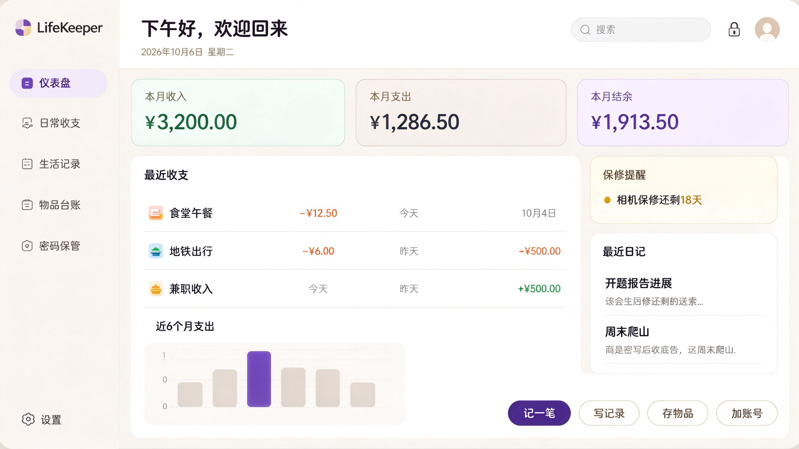

# LifeKeeper · 生活管家

**本地优先、隐私优先的个人生活管理网页**

钱花在哪、日子怎么过、东西放哪、密码是什么 —— LifeKeeper 帮你记着。

---

## 界面预览

  

> 上图为设计定稿，实际界面以最新代码为准。

---

## 功能特性

- **日常收支**：快速记账，9 类支出与 6 类收入，支持标签、账户、月份选择、多维筛选与月度汇总
- **生活记录**：随手记录文字与心情，草稿自动保存、可恢复，提供时间线与卡片两种视图
- **物品台账**：登记物品存放位置，常用位置速选，保修临期与过期自动标色提醒
- **密码保管**：账号密码本地加密存储，掩码显示、一键复制，内置安全密码生成器
- **仪表盘**：本月收支与结余总览、分类占比与近 6 个月趋势图表、快捷入口与保修提醒
- **安全门禁**：主密码锁定，支持手动锁定与无操作自动锁定，加密备份的导出与导入

---

## 快速开始

1. 用 VS Code 打开本项目，安装 **Live Server** 插件
2. 在资源管理器中右键 `index.html` → **Open with Live Server**
3. 浏览器访问 `http://127.0.0.1:5500`，首次打开设置主密码即可使用

> ⚠️ **不要直接双击 `index.html`**：`file://` 不是安全上下文，浏览器会禁用加密所需的 Web Crypto API，并拒绝加载 ES Module。

---

## 技术栈

**HTML5 + Tailwind CSS + 原生 JavaScript（ES Modules）** —— 无框架、无后端、无第三方运行时依赖；图表为手写原生 SVG；数据存储于浏览器 `localStorage`，数据访问层已预留 IndexedDB 无缝切换能力。

---

## 安全与隐私

- 所有数据**只保存在你的浏览器本机**，不经过任何服务器，应用不含统计、追踪与广告脚本
- 密码与备注使用 **PBKDF2-SHA256（210000 次迭代）+ AES-GCM-256** 加密，密钥不可导出
- 主密码仅在内存中使用，锁定、超时或关闭页面即清除
- 支持导出**加密备份**（推荐），备份与主密码分开保管即可安全迁移

> ⚠️ **忘记主密码无法找回**：没有服务端可以验证身份，加密数据在数学上不可恢复。请牢记主密码并定期导出备份。

---

## 文档

| 文档 | 内容 |
|---|---|
| [PRD.md](PRD.md) | 产品需求文档 |
| [DESIGN.md](DESIGN.md) | 设计系统与视觉规范 |
| [AGENTS.md](AGENTS.md) | 面向 AI 编码助手的工程规范 |

---

## 后续规划

- [ ] 移动端与平板响应式适配
- [ ] 深色模式
- [ ] Tailwind 本地构建，去除 CDN 依赖、实现完全离线可用
- [ ] IndexedDB 存储升级、图片附件支持

---

## 致谢

视觉设计参考 Notion 的暖色风格，仅作学习与个人使用。

## License

[MIT](LICENSE)
